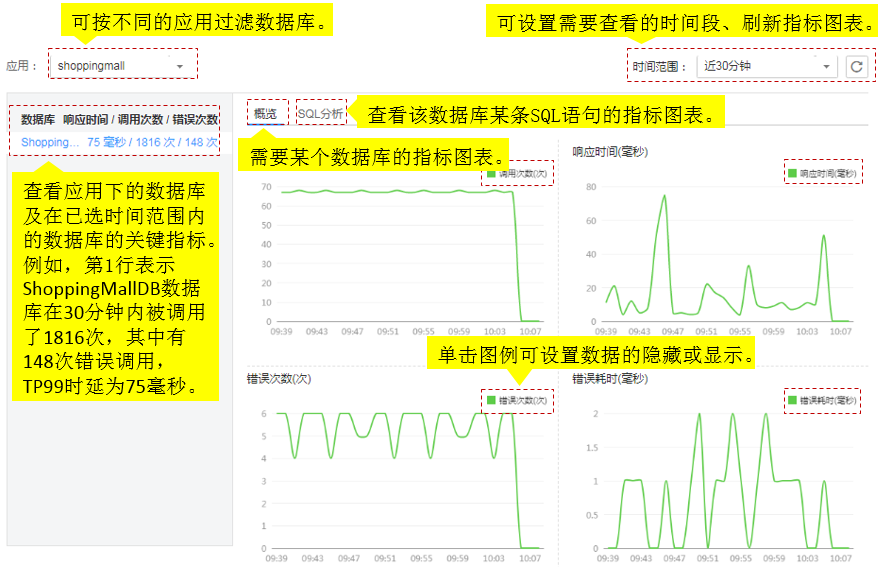
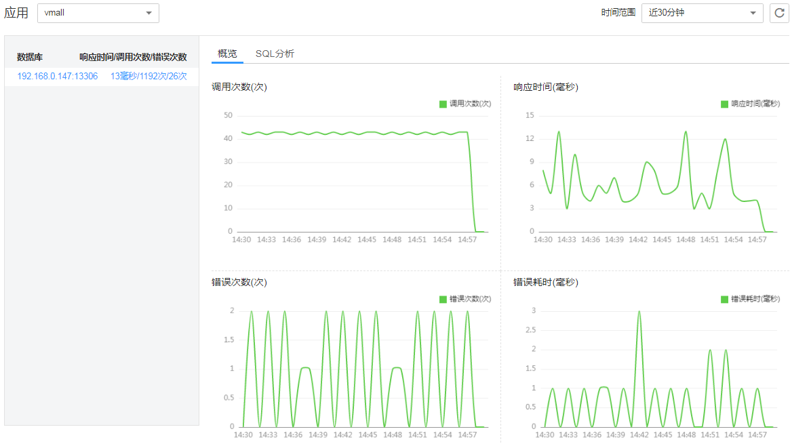
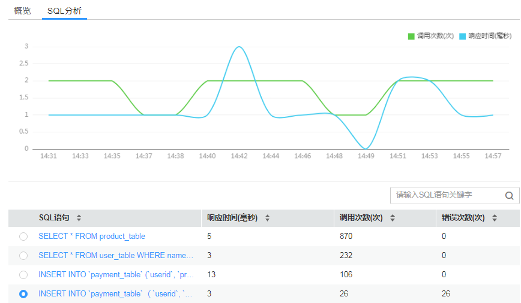
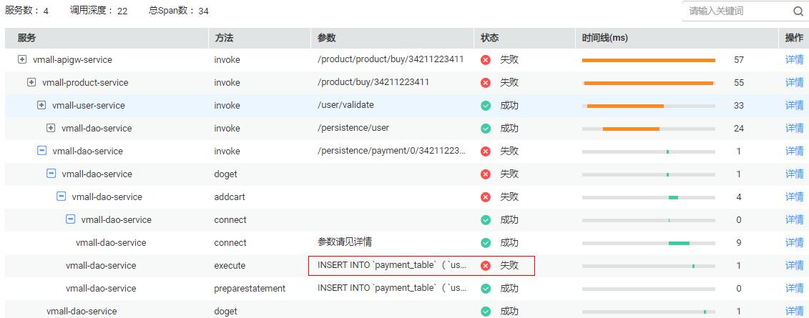
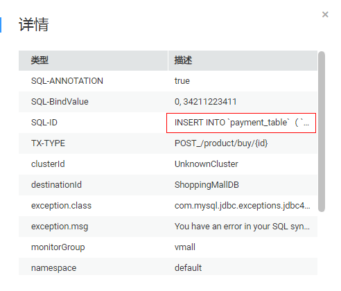

# SQL分析

通过图表形式展现数据库、SQL语句的调用次数、响应时间、错误次数等关键指标，用于分析异常SQL语句导致的数据库性能问题，异常SQL语句是指慢SQL语句和调用出错的SQL语句。SQL分析当前仅支持MySQL、Oracle、PostgreSQL关系型数据库。

## SQL操作界面说明

**图 1**  SQL界面图示  

## 异常SQL语句分析

数据库SQL语句异常，可能导致业务超时等性能问题。在日常运维中，可通过错误耗时、响应时间等关键指标对数据库进行监控，定位出那些执行耗时长、效率低、调用出错的SQL语句，并对其进行分析和优化。

SQL开关用来控制是否对SQL数据进行采集，操作前您需要确保该开关已开启，否则您将查询不到SQL数据。SQL开关默认为开启状态，若已被关闭，请在左侧导航栏中选择“采集管理 \> 采集配置”进行开启。

1.  在SQL界面中，设置右上角的时间范围，将时间调整到问题发生的时间段。
2.  在“概览”页签，通过数据库关键指标定位出应用中的问题数据库。数据库响应时间长、调用错误次数多都可能导致性能问题。

    

3.  分析该数据库出现性能问题的原因。

    单击“SQL分析”页签，在SQL语句列表中定位出异常SQL语句。

    

4.  进一步分析导致SQL语句异常的原因。
    1.  单击该异常SQL语句，跳转到调用链页面，查看异常SQL对整个业务的影响。

        

    2.  单击“操作”列的“查看调用关系”，找到异常SQL语句所在的方法。在该方法中对该SQL语句进行分析，例如，是没有用到索引、数据量过大、语法错误或出现死锁等原因导致SQL语句异常，找出原因后对SQL语句进行优化。

        

        

